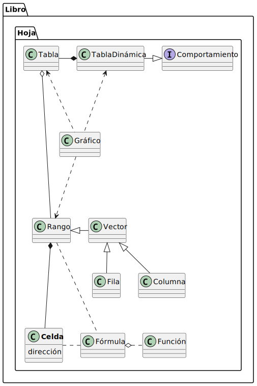

# Pequeñas anécdotas sobre las hojas de cálculo

||
|-|
||

Las hojas de cálculo son una herramienta indispensable en el ámbito empresarial, académico y personal para la organización de datos, análisis numérico y la toma de decisiones basada en información. 

A menudo aprendemos a usar las hojas de cálculo de manera empírica, enfocándose en lograr tareas específicas sin detenernos en comprender los elementos básicos. Entender los conceptos subyacentes a la aplicación, más allá de su funcionalidad práctica, es crucial para desbloquear el potencial completo de esta herramienta, permitiendo avanzar desde tareas básicas hacia análisis más complejos y personalizados.

## Itinerario

<table border=1>
    <tr>
        <td width="50%" valign=top>
        
- [La celda](docs/celda/README.md)
- [El rango](docs/rango/README.md)
- [El vector](docs/vector/README.md)
- [La tabla](docs/tabla/README.md)
- La tabla dinámica
- La hoja
- Las hojas
- Los gráficos
- Los libros
- El análisis
- La automatización
- El exterior
        </td>
        <td width="50%">
            
        </td>
    </tr>
</table>

[Carpeta de documentos](https://1drv.ms/f/s!AnIJHRHgFpG-lkytF3Qq4lMkKsqD?e=h6aQ7Y)
